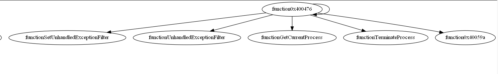

# 大作业报告

## 实验目标和实现情况
- 初期目标：做一个简易版的类似于IDA pro的交互页面（图示为IDA pro用户页面参照）
  - 能展示出exe文件的反汇编文件内容 √
  - 能展示出exe文件的16进制文件内容
  - 能展示出exe文件的字符串变量名 √
  - 能展示出exe文件的所有函数列表 √
  - 能展示出exe文件的函数调用关系图 √
  - 能展示出exe文件的函数内部流程图 √
  
  

- 实际完成情况
  - 对一个有do while循环，switch case语句和自定义函数调用的exe可执行程序进行了分析。
    - 将exe的反汇编内容输出到了disassemble.txt文件中
    - 函数调用关系图
      - 有点bug，不知道为什么画出来的是两个独立的关系图。按照手工分析，应该只有第一个图才对
    - 函数内部流程图
      - main()函数和random函数。dede函数没有调用，在反汇编文件内容中
      不存在它的相关信息，相当于没有
      - 画出来的main函数内部流程图有点乱，因为switch case语句它的判断复杂，出来的结果多了很多线路，手工分析后删掉了一些不必要的让整体流程图看起来更清晰，但是还没有找到能够自动化简化不必要路线的方法。
    - 获得了作为函数参数的字符串变量
    - 获得了各个函数局部变量
    - 获得了各个函数全局变量

- 还欠缺的地方
  - 未将结果展示到前端页面
  - 该处理代码还只能针对以mian函数为入口的exe程序
  - 还未进行多程序的代码测试，不敢保证其通用性

## 实现思路
- makefile编译一个尽量小的exe文件，使其入口从main函数开始
- 用pefile和capstone来反汇编exe，并获取相关信息
- 通过call指令划分函数段，并根据导入表信息替换调用的外部函数名称，自定义的函数就用地址代替，最后画出函数调用关系图 
 
   - 但是不知道为什么画出来的是两个并列的独立的关系图。按照手工分析，应该只有第一个图才对。第二个图如下
    
- 根据jcc指令划分函数内部基本块，然后画出函数内部流程图。
   - main函数一开始是画出来的图是图一这样的，不太能显而易见的看出函数逻辑。分析了一下手动删掉一些不必要的，画出了图二的图片。
    
    
   - 自定义函数random画出来的
    
- 获得了作为函数参数的字符串变量
   - 如果要将字符串作为参数传入函数，结构一定是
push xxx ，可以利用这一点获取可能是字符串的地址，然后找出字符串所在的节表，通过判断是不是键盘上的可打印字符来筛选出字符串.
  

- 函数参数个数
   - 要知道函数如何处理参数，这就要涉及到函数调用约定主要的函数调用约定有以下三种：cdecl、stdcall、fastcall
       - cdecl调用方式，主要是在c语言中使用的方式，由调用者负责处理栈。如下图函数调用结束后，使用add esp，4命令整理栈。
       - stdcall 方式常用于win32 API ,该方式由被调用者清理栈，函数结尾时使用ret 4 清理栈空间。Ret 4命令的含义为ret + pop 4
       - fastcall与stdcall类似，但函数会使用部分寄存器去传递部分参数（从CPU的角度来讲，访问寄存器的速度会比内存快得多），被调用函数的前两个参数会使用寄存器存储
   - 所以识别函数参数个数，只需要查看函数调用后add esp 后的数字，或者函数调用后 ret 后面的数字。（此处只讨论前两种调用方式）

- 获得了各个函数局部变量个数
  - 因为局部变量存储在栈帧中，故使用时的形式如  [ebp  …]，利用这一点就可以找出函数局部变量个数
  
- 获得了各个函数全局变量
  - 全局变量存储栈空间中的高位上，访问时使用指针访问。系统API的调用方式也是使用指针进行访问，但是会使用call指令进行访问。局部变量会使用指针访问但是具有特定的格式，可以根据此来区分是否是全局变量的调用。
  

