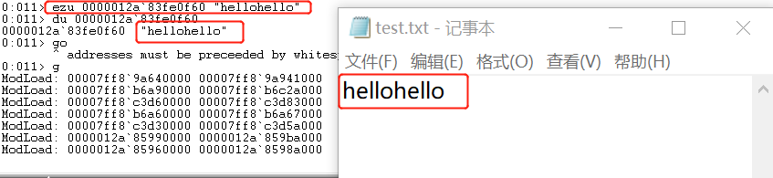

## 实验报告一

#### 实验内容
　　编写一个release版本的 hello world 程序。通过修改程序可执行文件的方式（不是修改源代码），使得程序运行后显示的内容不为hello world，变成 hello cuc！
#### 实验过程
- 生成release版本可执行文件<br>
  1、用记事本编写一个简单的helloword.c程序<br>
```
#include <stdio.h>
#include <Windows.h>
int main()
{
      MessageBox(NULL,"hellow world","hello",MB_OK);
      return 0;
}
```

  2、使用cl编译helloword.c生成helloword.obj<br>
  
```
cl /c /O1 helloword.c
# /O1 创建最小代码
```

  3、使用link链接helloword.obj生成helloword.exe

```
link /ENTRY:main /NODEFAULTLIB /ALIGN:16 User32.lib helloword.obj
# /ENTRY:main：指令链接的入口，减少不必要的东西
# /NODEFAULTLIB：去掉默认加载的库
# /ALIGN:16：指定每一节对齐的字节数，将其值缩小
# User32.lib：加载User32库，因为函数里面引用了MessageBox，该函数是User32的
```

- 使用二进制编辑器修改可执行文件内容(使用Winhex)
  - 找到`world`将其替换成`cuc`<br>
  <br>
　<br>
  <br>
  <br>
  <br>
- 将修改后的可执行文件保存并执行查看结果
  - 原程序<Br>
    <br>
  - 修改后的程序<br>
    <br>