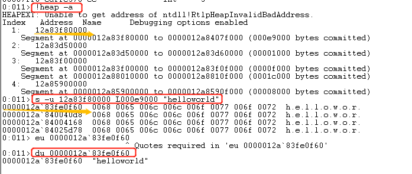

## 实验报告三

#### 实验内容
　　编写一个release版本的 hello world 程序。通过修改程序可执行文件的方式（不是修改源代码），使得程序运行后显示的内容不为hello world，变成 hello cuc！
- 在notepad（32位64位均可）中，输入一段文字。然后使用调试器，在内存中修改这段文字。使得没有在界面操作notepad的修改文字的情况下。notepad中显示的文字变化。
提示，在调试器中定位控件缓存的内存地址，可以用搜索、逆向、消息截获分析、API截获分析等方法。
- 软件是数据和对数据的操作的集合。
软件安全就是研究软件的操作的具体过程、数据的具体形式，然后想办法获得、修改、破坏或者实施隐藏。又分为攻和防两个方面。
底层的软件，一次操作所能影响的数据少，操作的逻辑简单。
越到高层，一次操作所能影响的数据越多，操作的逻辑越复杂。
例如
指令 -> C语言语句 -> 函数 -> 对象
汇编 -> C -> C++ -> 各类脚本。
所以，我们进行软件攻防也有两种基本的方法。
hook 和 DKOM
hook，挂钩，即找到程序中的原有代码，并修改其代码，增加、减少或者篡改原用功能。达到授权破解（keygen）、作弊（游戏外挂）、隐藏（隐蔽攻击痕迹防止被防御软件查杀）等目的。
DKOM，直接内核对象操作。是一种典型的直接对程序内部数据的攻击。

#### 实验过程
- 首先打开notepad，在notepad中写入`helloworld`
- 打开windbg，File——>attach to a process——>选择notepad.exe，将notepad.exe附加到windbg上
- 在windbg中查找在notepad中写入的字符串`helloworld`。可以选择在全局搜索，但是效率比较低。这里我们猜测字符串在进程堆中，所以在堆中搜索。
  

  ```
  !heap -a  # 列出所有的堆

  # 根据截图的结果我们可以看出，一共有四个堆，我们先选择第一个进行尝试搜索
  s -u 12a83f80000 L000e9000 "helloworld"
     # s 表示搜索
     # u 表示按照Unicode标准搜索
     # 12a83f80000 表示搜索起始地址
     # 000e9000 表示搜索的范围

  # 截图结果可以看出在第一个堆中我们找到了匹配的结果，我们用下面一条指令再验证一次
  du 0000012a`83fe0f60

  # 根据显示的结果，我们已经可以确定0000012a`83fe0f60就是helloworld的首地址
  ```

- 下面对字符串进行修改，使用`ezu`指令修改字符串为`hellohello`。最终可以看到notepad中的内容编成我们修改的内容<br>

