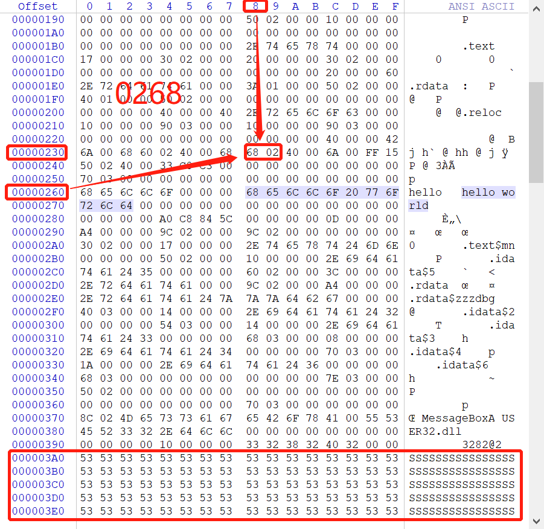
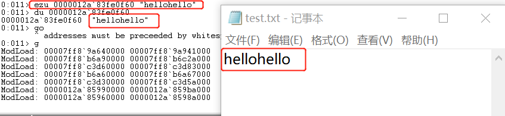
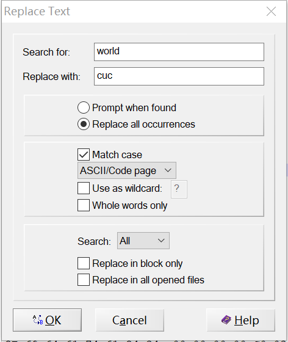

## 实验报告二

#### 实验内容
上一题的程序中，修改的显示内容变为一个很长的字符串（至少2kb长）。并且保证程序正常运行不崩溃。
- 提示，可执行文件中原有的空间有限，必须要新加入数据，加入数据后必须要修改.text字段中的指针。
　　
#### 实验过程
- 对上一题生成的helloword.exe文件进行反汇编。从结果可以看出`helloworld`存储的地址是`400268h`(前四个push是MessageBox的参数)
  - 使用命令：`dumpbin /disasm hellword.exe`

```
Dump of file helloword.exe

File Type: EXECUTABLE IMAGE

  00400230: 6A 00              push        0
  00400232: 68 60 02 40 00     push        400260h
  00400237: 68 68 02 40 00     push        400268h
  0040023C: 6A 00              push        0
  0040023E: FF 15 50 02 40 00  call        dword ptr ds:[00400250h]
  00400244: 33 C0              xor         eax,eax
  00400246: C3                 ret

  Summary

         140 .rdata
          10 .reloc
          20 .text
```
- 查看PE文件头。可以看出`image base`的值为`400000h`，那么`hello world`字段的偏移地址为`268h`.text字段的偏移地址为`00000230h`.
  - 使用命令：`dumpbin /headers /nologo helloword.exe`

```
Dump of file helloword.exe

File Type: EXECUTABLE IMAGE

  00400230: 6A 00              push        0
  00400232: 68 60 02 40 00     push        400260h
  00400237: 68 68 02 40 00     push        400268h
  0040023C: 6A 00              push        0
  0040023E: FF 15 50 02 40 00  call        dword ptr ds:[00400250h]
  00400244: 33 C0              xor         eax,eax
  00400246: C3                 ret

  Summary

         140 .rdata
          10 .reloc
          20 .text

D:\大三下\软件与系统安全\Q1 helloworld\cl>dumpbin /headers /nologo helloword.exe

Dump of file helloword.exe

PE signature found

File Type: EXECUTABLE IMAGE

FILE HEADER VALUES
             14C machine (x86)
               3 number of sections
        5C84C8A0 time date stamp Sun Mar 10 16:19:44 2019
               0 file pointer to symbol table
               0 number of symbols
              E0 size of optional header
             102 characteristics
                   Executable
                   32 bit word machine

OPTIONAL HEADER VALUES
             10B magic # (PE32)
           14.15 linker version
              20 size of code
             150 size of initialized data
               0 size of uninitialized data
             230 entry point (00400230)
             230 base of code
             250 base of data
          400000 image base (00400000 to 0040039F)
              10 section alignment
              10 file alignment
            6.00 operating system version
            0.00 image version
            6.00 subsystem version
               0 Win32 version
             3A0 size of image
             230 size of headers
               0 checksum
               3 subsystem (Windows CUI)
            8540 DLL characteristics
                   Dynamic base
                   NX compatible
                   No structured exception handler
                   Terminal Server Aware
          100000 size of stack reserve
            1000 size of stack commit
          100000 size of heap reserve
            1000 size of heap commit
               0 loader flags
              10 number of directories
               0 [       0] RVA [size] of Export Directory
             340 [      28] RVA [size] of Import Directory
               0 [       0] RVA [size] of Resource Directory
               0 [       0] RVA [size] of Exception Directory
               0 [       0] RVA [size] of Certificates Directory
             390 [      10] RVA [size] of Base Relocation Directory
             280 [      1C] RVA [size] of Debug Directory
               0 [       0] RVA [size] of Architecture Directory
               0 [       0] RVA [size] of Global Pointer Directory
               0 [       0] RVA [size] of Thread Storage Directory
               0 [       0] RVA [size] of Load Configuration Directory
               0 [       0] RVA [size] of Bound Import Directory
             250 [      10] RVA [size] of Import Address Table Directory
               0 [       0] RVA [size] of Delay Import Directory
               0 [       0] RVA [size] of COM Descriptor Directory
               0 [       0] RVA [size] of Reserved Directory


SECTION HEADER #1
   .text name
      17 virtual size
     230 virtual address (00400230 to 00400246)
      20 size of raw data
     230 file pointer to raw data (00000230 to 0000024F)
       0 file pointer to relocation table
       0 file pointer to line numbers
       0 number of relocations
       0 number of line numbers
60000020 flags
         Code
         Execute Read

SECTION HEADER #2
  .rdata name
     13A virtual size
     250 virtual address (00400250 to 00400389)
     140 size of raw data
     250 file pointer to raw data (00000250 to 0000038F)
       0 file pointer to relocation table
       0 file pointer to line numbers
       0 number of relocations
       0 number of line numbers
40000040 flags
         Initialized Data
         Read Only

  Debug Directories

        Time Type        Size      RVA  Pointer
    -------- ------- -------- -------- --------
    5C84C8A0 coffgrp       A4 0000029C      29C

SECTION HEADER #3
  .reloc name
      10 virtual size
     390 virtual address (00400390 to 0040039F)
      10 size of raw data
     390 file pointer to raw data (00000390 to 0000039F)
       0 file pointer to relocation table
       0 file pointer to line numbers
       0 number of relocations
       0 number of line numbers
42000040 flags
         Initialized Data
         Discardable
         Read Only

  Summary

         140 .rdata
          10 .reloc
          20 .text
```
- 用winhex打开helloword.exe文件.在文件末尾加上2048个`S`，起始偏移地址为`03A0`;根据.text的起始偏移地址可以找到`hello world`的偏移地址`0268h`,将其改为`03A0`
  - 修改前

  - 修改后


- 将修改后的PE文件保存，然后运行，就可以显示2048个`S`了<br>

